# 文献阅读笔记

## Todo List

### [Image/Video Captioning](#IVC)

- [X]  Say As You Wish: Fine-Grained Control of Image Caption Generation With Abstract Scene Graphs
- [X]  Context-Aware Group Captioning via Self-Attention and Contrastive Features
- [X]  More Grounded Image Captioning by Distilling Image-Text Matching Model

### [Image/Video-Text](#IVT)

- [X]  ActBERT: Learning Global-Local Video-Text Representations
- [X]  Context-Aware Attention Network for Image-Text Retrieval

### [Vision Language Pretrain](#VLP)

- [X]  [多模态预训练模型综述](https://zhuanlan.zhihu.com/p/435697429)
- [X]  [NeurIPS2019] ViLBERT: Pretraining Task-Agnostic Visiolinguistic Representations for Vision-and-Language Tasks
- [X]  Fusion of Detected Objects in Text for Visual Question Answering
- [X]  [EMNLP2019] LXMERT: Learning Cross-Modality Encoder Representations from Transformers
- [X]  VISUALBERT: A Simple And Performant Baseline For Vision And Language
- [X]  [AAAI2020] Unicoder-VL: A Universal Encoder for Vision and Language by Cross-modal Pre-training
- [X]  [ICLR2020] VL-BERT: Pretraining of Generic Visuallinguistic Representations
- [X]  [ECCV2020] UNITER: UNiversal Image-TExt Representation Learning
- [X]  [ECCV2020] Oscar: Object-Semantics Aligned Pre-training for Vision-Language Tasks
- [X]  Pixel-BERT: Aligning Image Pixels with Text by Deep Multi-Modal Transformers
- [X]  [ACL2021] UNIMO: Towards Unified-Modal Understanding and Generation via Cross-Modal Contrastive Learning
- [X]  [ICML2021] Learning Transferable Visual Models From Natural Language Supervision
- [X]  Data2Vec: A General Framework for Self-supervised Learning in Speech, Vision and Language
- [X]  [ICML2021] ViLT: Vision-and-Language Transformer Without Convolution or Region Supervision
- [X]  [CVPR2021] OSCAR+: VinVL: Revisiting Visual Representations in Vision-Language Models

### [Multilingual Cross-modal Pretrain](#MCP)

- [X]  [ACL2020] Multimodal Transformer for Multimodal Machine Translation
- [X]  [ACL2020] Unsupervised Multimodal Neural Machine Translation with Pseudo Visual Pivoting
- [X]  [CVPR2021] M3P: Learning Universal Representations via Multitask Multilingual Multimodal Pre-training
- [X]  [CVPR2021] UC2: Universal Cross-lingual Cross-modal Vision-and-Language Pre-training
- [X]  [ICML2021] ALIGN: Scaling Up Visual and Vision-Language Representation Learning With Noisy Text Supervision
- [X]  Retrieve Fast, Rerank Smart: Cooperative and Joint Approaches for Improved Cross-Modal Retrieval
- [X]  [EMNLP2021] MURAL: Multimodal, Multitask Retrieval Across Languages
- [X]  xGQA: Cross-Lingual Visual Question Answering
- [X]  Wukong: 100 Million Large-scale Chinese Cross-modal Pre-training Dataset and A Foundation Framework
- [X]  Delving Deeper into Cross-lingual Visual Question Answering

## 笔记

#### 一些评价指标

##### **BLEU**

是IBM在2002提出的，用于机器翻译任务的评价指标。

$$bleu_n=\displaystyle\frac{\sum_{c\in candidates}\sum_{n-gram\in c} Count_{clip}(n-gram)}{\sum_{c\in candidates}\sum_{n-gram\in c} Count(n-gram')}$$

其中$n-gram$代表连续判据的连续单词数，$n=1$时为单词级别的准确性，高阶$n$可以衡量句子的流畅度。

分子中的两个求和符号分别代表着网络生成的句子$candidates$和该句的$n-grams$，$Count_{clip}(n-gram)$代表着该句的全部$n-gram$有多少出现在了groundtruth中；分母则是全部的$n-grams$数量。

**BLEU的优点**是它考虑的粒度是$n-gram$而不是词，考虑了更长的匹配信息；**BLEU的缺点**是不管什么样的$n-gram$被匹配上了，都会被同等对待。

##### **Consensus-based image description evaluation (CIDEr)**

这个指标**将每个句子都看作“文档”**，将其表示成TF-IDF(Term Frequency Inverse Document Frequency)向量的形式，然后计算参考与模型生成的caption的**余弦相似度**，作为打分，其具体流程如下：

1、将“候选语句”和“参考语句”中的词汇全都映射成它的词根；

2、为每一个$\omega_k$计算TF-IDF权重：

$$
g_k(s_{ij})=\displaystyle\frac{h_k(s_{ij})}{\sum_{w_l\in\Omega}h_l(s_{ij})}log(\displaystyle\frac{|I|}{\sum_{I_p\in I}min(1,\sum_qh_k(s_{pq})})

$$

其中$\omega_k$代表某一个$n-gram$，$s_{ij}$代表第$i$个图像的第$j$个语句，其出现次数为$h_k(s_{ij}$，$\Omega$代表全部$n-gram$集合。

第一项表示TF权重，它给予在“参考语句”中经常出现的$n-gram$更高的权重；第二项表示IDF项，它给予在每一张图像的“参考语句”中都出现过的$n-gram$更低的权重。

3、计算$CIDEr$分数：

$$CIDEr_n(c_i,S_i)=\displaystyle\frac{1}{m}\displaystyle\sum_j\displaystyle\frac{g^n(c_i)g^n(s_{ij})}{||g^n(c_i)||||g^n(s_{ij})||}$$

其中，$\omega_k$在某个“候选语句”c_i(表示针对第$i$个图像，模型生成的语句)中出现的次数表示为$h_k(c_i)$，$g^n(c_i)$代表长度为n的$n-gram$的权值向量。

4、$CIDEr(c_i,S_i)=\displaystyle\sum_{n=1}^N\omega_nCIDEr_n(c_i,S_i)$，其中$\omega_n=\displaystyle\frac{1}{N},N=4$。

##### **METEOR**

一种基于模型caption与答案word-to-word映射的考虑精确率和召回率的指标：

$$
P=\displaystyle\frac{mapped}{total_s},R=\displaystyle\frac{mapped}{total_r}

$$

其中$mapped$代表对应上的词语个数，$total_s$代表模型生成句子的词语总个数，$total_r$代表参考译文中的词语总个数，其最终的结果为二者的调和平均，并使用$Penalty$来调整：

$$
F_{means}=\displaystyle\frac{10PR}{R+9P},Score=F_{means}\times(1-Penalty)

$$

其中$Penalty$为句子在更宏观尺度上的流畅度度量，对更大的$n-gram$时匹配效果更好的caption，其$Penalty$更小。

##### **ROUGE**

ROUGE-L主要计算的是最长公共子序列的F-measure:

$$
R_{lcs}=\displaystyle\frac{LCS(X,Y)}{m},P_{lcs}=\displaystyle\frac{LCS(X,Y)}{n},F_{lcs}=\displaystyle\frac{(1+\beta^2)R_{lcs}P_{lcs}}{R_{lcs}+\beta^2P_{lcs}}

$$

其中$X，Y$表示的是模型生成句子和参考译文。$m,n$分别表示它们的长度。当有多个参考译文时，**挑选最高分数**作为最终的评判分数。

#### 一些数据集

|        Datasets        | Num of Images | Num of Image-caption Pairs | Languages |
| :-----------------------: | :-------------: | :--------------------------: | :---------: |
|    MS-COCO Captions    |     111K     |            558K            |     1     |
|    VG Dense Captions    |     103K     |            5.1K            |     1     |
|      SBU Captions      |      1M      |             1M             |     1     |
| Conceptual Captions 3M |      3M      |             3M             |     1     |
|        LAION-400        |     400M     |            400M            |     1     |
| Conceptual Captions 12M |      12M      |            12M            |     1     |
|        Multi30k        |      31K      |            155K            |     4     |
|           XTD           |      1K      |             1K             |     7     |
|           Wit           |     11.4M     |            16M            |    108    |
|        Alt-Text        |     1.8B     |            1.8B            |    110    |

#### 一些NLP概念

##### Byte Pair Encoding(BPE)

BPE（字节对编码）是一种简单的数据压缩形式，其中最常见的一对连续字节数据被替换为该数据中不存在的字节，后期使用时需要一个替换表来重建原始数据；棋步骤如下：

1. 准备足够大的训练语料；
2. 确定期望的subword词表大小；
3. 将单词拆分为字符序列并在末尾添加后缀“ </ w>”，统计单词频率。 本阶段的subword的粒度是字符。 例如，“ low”的频率为5，那么我们将其改写为"l o w \</w>" ：5；
4. 统计每一个连续字节对的出现频率，选择最高频者合并成新的subword；
5. 重复第4步直到达到第2步设定的subword词表大小或下一个最高频的字节对出现频率为1。

在编码过程中，首先将字节表按从长到短的顺序排列，之后对句子中每个单词在字节表中进行比对，如果存在一个字节是该单词的子字符串，就作为其token之一

##### WordPiece

WordPiece算法可以看做是BPE的变种，不同点在于，WordPiece基于概率生成新的subword而不是最高频字对。算法如下：

1. 准备足够大的训练语料，确定期望的subword词表大小；
2. 将单词分成字符序列；
3. 基于第2步训练语言模型；
4. 将所有可能得subword单元选择加入语言模型后最大程度地增加训练数据概率的单元作为新的单元；
5. 重复第1步设定的subword此表大小或概率量低于某一阈值。

第4步的具体解释：对于一个由$n$个子词$t_i$组成的句子$S=(t_1,t_2,\dots,t_n)$，假设子词独立，则句子$S$的似然值等于子词似然的乘积：$logP(s)=\displaystyle\sum_{i=1}^nlogP(l_i)$，假设将两个相邻位置$x,y$子词合并为子词$z$，则原句似然值变化量可表示为：

$$
\Delta logP(S)=logP(l_z)-(logP(l_x)+logP(l_y))=log\displaystyle\frac{P(l_z)}{P(l_x)P(l_y)}

$$

可以看出似然值的变化即两子词互信息，则合并的两子词需具有最大的互信息，其在句子中的关联性最强。

## Image/Video Captioning

#### Say As You Wish: Fine-Grained Control of Image Caption Generation With Abstract Scene Graphs

* 图神经网络的放在后面看

#### Context-Aware Group Captioning via Self-Attention and Contrastive Features

* Motivation: 目前的图像理解工作都是对单张图片的理解，本文提出一种新的、群体理解的任务，可以从一组图片中提取、比对信息并提取出一个满足要求的子集。这一新任务有两大要求：1、模型需提炼出图片集合的主要共同特征；2、模型需能描述目标图片子集与其他图片的主要区别。
* Data Construct: 数据集基于单张图片理解数据集进行构建，首先对数据集里的图片描述使用一个Language Parser来处理成图，并分析该图的主要成分，将具有相同元素的图片构建成集合，并对有相同细节描述的图片构建子集，通过选择比较常见的集合和手动二次筛选来构建数据集。该研究用了Conceptual Captions和Stock Captions两个数据集，最终的数据量为200k/146k。

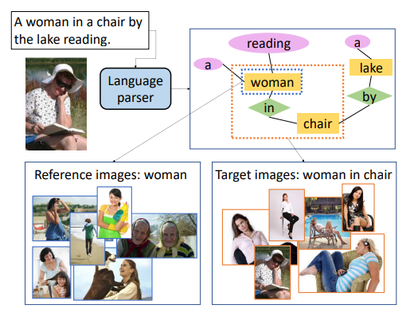

* Method: 数据在送入网络之前使用一个在ImageNet数据上预训练的ResNet50作为特征提取器，取POOL5的输出$x\in\mathbf{R}^{2048}$作为模型的输入，baseline选择对set=15，aim=5的集合分别取平均送入LSTM。研究采用的方法则是使用Transformer分别为set和aim输入特征进行feature aggregation（使用共享权重），并通过计算Transformer输出特征之差引入了对比表示，一起送入LSTM来进行学习。
* Results: 文章选择了[BLEU](#BLEU)、[CIDEr](#CIDEr)、[METEOR](#METEOR)与[ROUGE](#ROUGE)作为评价指标，在这些评价指标上，使用Self-Attention+Constrast的结果都要好于消融实验，且都要远高于baseline。

#### More Grounded Image Captioning by Distilling Image-Text Matching Model

* Motivation: 将图像理解器对图像目标精确识别并精确给出描述称为“有依据图像理解”（Grounded Image Captioning），然而这一目标还远未实现，然而为每一条数据加上强监督的描述框是一件费时费力的事，本文提出一种Part-of-Speech(POS)强化的图像-文本匹配模型POS-SCAN，可以做到对图像-文本对的精确区域确定，也可以作为理解器的视觉注意力模块使用。
* Method(structure): 模型分为两个部分：图像理解器和图像-文本匹配器：1、在图像-文本匹配器部分，图像的输入为使用提取器提取到的特征集合，并进行维度变换以适应文本特征，记作$v_i$；文本的输入只选择名词，使用一个双向GRU的均值来进行编码，记作$e_t$。在此之后计算其余弦相似度$s_{it}=\displaystyle\frac{v_i^Te_t}{||v_i||||e_t||}$并进行归一化，使用针对第$t$个单词的特征$a_t^v$对文本特征的余弦相似度求均值的方法得到图像文本匹配的全局相似度；2、在图像理解器方面，则使用注意力LSTM与语言LSTM结合的方式，对t时刻语言LSTM的输出、图像特征均值和该时刻编码词特征作为注意力LSTM的输入，获得一个隐态特征，并使用该特征来获得可能的输出文字的条件分布。
* Method(training): POS-SCAN在图像理解数据集上进行与训练并锁定权重，用作注意力的引导与细粒度反馈器。模型使用一种带有图像理解器注意力权重$\beta_t$与POS-SCAN注意力权重$\alpha_t$的散度约束正则化损失函数$l_1(\theta)=\displaystyle\sum_{t=1}^n\{-log(p_{\theta}(y_t^*|y_{1:t-1}^*))+\lambda_1\mathbb{I}_{y_t^*=y^{noun}}KL(\beta_t||\alpha_t)\}$来进行图像理解器的训练，使模型可以更好的关注图像的特定区域。之后使用反馈函数为$r(y_{1:n})=CIDEr(y_{1:n})+\lambda_2S(I,y_{1:n})$的强化学习训练方法来对图像理解器进行进一步训练，以获得最终的结果。

## Image/Video-Text

#### ActBERT: Learning Global-Local Video-Text Representations

* Motivation: BERT在自然语言处理的预训练任务中有着十分优秀的表现，本文基于BERT推广到视频-语言联合任务中，在之前的研究中使用的方法是将视频特征离散化为token，并送入BERT模型，然而这一离散化过程会损失掉无数局部信息，比如交互、动作等。本文提出了ActBERT，该结构可以结合全局的动作、局部的目标与文字描述；本文还提出Tangled Transformer Block（TNT）来对三种特征进行编码，通过交错的编码结构提高了多模态特征之间的相互作用，以此提高模型表现；
* Model(structure): ActBERT的输入有四类，包括动作、图像区域、文字描述与特殊token，其中特殊token用于区分不同的输入；包含了四种嵌入：位置嵌入、分割嵌入、token嵌入与视觉嵌入，其中位置嵌入提供了对不同动作的时序信息，而物品则采用相同的嵌入；分割嵌入提供了与不同视频切片的对应关系；token嵌入表征了输入信息的模态；视觉输入包括动作与物体，动作使用3D CNN，物体使用FastRCNN来确定物体的坐标信息输入。
* Model(detail): ActBERT还提出了一种TNT的transformer结构，这种结构将视觉信息和语言信息有效的结合，通过两个多头注意力模块来进行融合（互相提供Key与Value），并利用一个全局线索来从语言和视觉特征中进行引导（Query），通过跨模态的特征融合，TNT可以动态地选择有效特征进行目标预测；
* Method(Training): ActBERT的预训练包括四个任务：全局与局部线索的掩码语言建模、掩码动作分类、掩码目标分类与跨模态匹配，其中全局与局部线索的掩码语言建模与BERT类似，对于语言的输入进行随机Mask，要求模型利用视觉信息来提供缺失的信息；掩码的动作、目标分类使用掩码的动作特征与目标特征，模型分别来通过信息预测动作分类与空间分布；跨模态匹配使用线性输出层，通过语句和视觉特征的相关性来表征匹配相关性。

#### Context-Aware Attention Network for Image-Text Retrieval

* Motivation: 传统的图像-语言注意力模型往往忽略一个词或图像区域在全局中可能有不同的语义，全局上下文是指两种模态（模态间）之间的交互和对齐以及单个模态（模态内）中的语义相关性。本文提出一种上下文感知注意力网络（Context-Aware Attetion Network, CAAN），可以从全局的角度基于给定的上下文来适应的选择信息片段，包括单模态内语义与区域、单词之间的对齐的相关性。本文还提出了语义注意力机制（Semantic Attention, SA）来获得模态内的潜在相关性；
* Method: 网络的输入为一幅图像与其对应的文本，分别通过Bottom-up Attention(Fast-RCNN+ResNet)与Bi-GRU进行编码与映射，得到对应矩阵$V\in\mathcal R^{\mathcal D\times m}$与$U\in\mathcal R^{\mathcal D\times n}$，CAAN的主体部分为一个上下文感知注意力模块，其具体过程可分为以下几步：i.获得融合矩阵$H=tanh(V^TKU)$；ii.计算模态间注意力：$H_{ij}^{uv}=\displaystyle\frac{[H_{ij}]_{+}}{\sqrt{\sum_{k=1}^n[H_{kj}]^2_+}},H_{ij}^{vu}=\displaystyle\frac{[H_{ij}]_{+}}{\sqrt{\sum_{k=1}^m[H_{ik}]^2_+}}$；iii.计算模态内注意力：$H^v=V^TM_1V,H^u=U^TM_2U$；iv.计算归一化的注意力：$f(V,U)=softmax(W^vtanh(H^vV^TQ_1+H^{uv}U^TQ_2))$；v.最终的跨模态注意力（以图像为例）：$\hat v=Vf(V,U)$；vi.模型的损失：$L(\hat v,\hat u)=\displaystyle\sum_{\hat v^-,\hat u^-}\{max[0,m-S(\hat v,\hat u)+S(\hat v,\hat u^-)]+max[0,m-S(\hat v,\hat u)+S(\hat v^-,\hat u)]\}$，其中$S$为匹配函数，定义为矩阵内积

## Vision Language Pretrain

#### General Idea

Vision Language Pretrain 一般包含三个关键技术：特征提取、特征融合以及预训练任务，其大致思路为：

1、特征提取：对图像与文本数据获得token，一般对文本使用BERT的token生成器（或LSTM），图像则使用卷积网络，有Rol、Pixel、Patch等形式；

**特征提取要解决的问题是：怎么分别量化文字和图像，进而送到模型学习？**

2、特征融合：目前主流有两种：双流two-stream或者单流single-stream，前者为双塔结构，先经过preprocess再进行交互，交互发生在深层空间；另一种则是使用如Transformer等网络，从浅层就开始交互，融合更深更灵活；剑走偏锋的还有Multi-stream方法，NOTE；

**特征融合要解决的问题是：怎么让文字和图像的表征交互？**

3、预训练任务：主要有三种：Masked Language Modeling（屏蔽语言的任务）、Masked Region Modeling（屏蔽图像区域的任务，随即屏蔽概率15%）与Image-Text Matching（将Image Token与文本cls做元素乘来学习相似性）。

**预训练任务就是：怎么去设计一些预训练任务来辅助模型学习到图文的对齐信息？**

#### [NeurIPS2019] ViLBERT: Pretraining Task-Agnostic Visiolinguistic Representations for Vision-and-Language Tasks

* Motivation: 对于大型预训练模型BERT，其在视觉-文本领域的迁移需要对模型进行改进以适应，如果只是用传统的BERT结构将面对许多问题：1、单纯的输入会导致图像数据离散化、丢失大量信息；2、对待视觉、文本两种不同模态的方式完全一样，忽略了在信息冗余度、结构等上的诸多差异；3、使用BERT处理大量视觉token会破坏其在语言上的预训练结果。
* 特征提取: 对于文本数据，使用与BERT相同的方法，即Word Embedding+Sentence Embedding+Position Embedding；在视觉数据中，则是使用一个训练好的ResNet101-backended-FastR-CNN来对超过置信阈值的具有更高置信度的若干区域，提取其特征，并使用其位置坐标作为Position Embedding叠加到特征上作为输入；其遮蔽方式与BERT相似，都是15%的遮蔽，文本上采取80%的置零、10%替换、10%不变，在视觉特征上则是90%置零、10%不变；

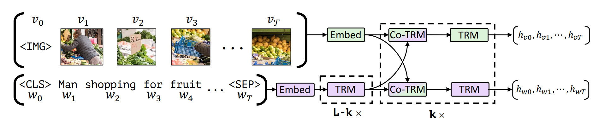

* 特征融合：本文提出一种Co-attentional Transformer结构，是一种典型的双流构型，这一构型首先在文本Token上通过$L-K$个Transformer，再对图像和文本的Token进行融合，使用对方来生成自己的Key与Value，后格接一个Transformer，该构型作为一组，共使用$K$组Co-TRM结构来得到最后的输出$h_{v0},\dots,h_{vT},h_{w0},\dots,h_{wT}$
* 预训练任务：本文介绍了包括屏蔽与匹配两种预训练任务，在屏蔽任务中，对图像与文本数据按上文介绍的过程进行屏蔽，使用最小化KL散度的方式来对模型进行优化；在匹配任务中，则是使用两种模态的头Token：\与\<CLS\>的输出进行点乘，使用一个线性分类器确定其是否匹配。
* Addition: 本文还介绍了使用ViLBERT的一些下游任务，包括VQA、VCR、GRE(Grounding Referring Expressions)与CIR(Caption-based Image Retrieval)，其中比较有趣的是Zero-shot CIR任务，该模型在没有经过任何迁移训练的情况下进行图片检索，达到了31.86的Top1 Acc，证明了该模型特征提取的有效性。

#### Fusion of Detected Objects in Text for Visual Question Answering

* Motivation: 文章描述的很复杂，但是实际上就是试图通过设计实验回答几个很基础的问题：如何对文本和视觉数据进行编码、文本如何与视觉匹配、特征融合的顺序（late/early fusion）、对文本对语义编码前就与视觉进行融合是否合理等……基于此文章提出了两种网络构型，一种是仅在最后进行特征融合的Dual Encoder结构，一种是本文的创新Bounding Box in Text Transformer（B2T2）结构，来回答上述问题
* 特征提取: 本文在文本上才去了BERT使用的tokenizer，文本的Position Embedding与Sentence Embedding构成方式与BERT一致，在问题与答案之间使用/<SEP/>分置，对于图像使用了基于ResNet架构的网络来进行Token的获取，对于Bounding Box的位置信息，选取其左下角坐标、宽与高记录其位置信息，对这个4维tuple使用一种特殊设计的Embedding来展成$d$维，并叠加到Vision Token上；在B2T2输入排布方式上也有新的设计，在文本信息提及该Box的位点插入该Token；
* 特征融合: 两种结构，Dual Encoder与B2T2，前者属于Late fusion的单流构型，BERT用于处理文本特征，在/<CLS/>输出上与ResNet的特征进行一个product($xAy^T$)，而B2T2则是一种Early fusion的单流构型，在输入上就已经完成了对cross modal fusion，在/<CLS/>上接一个线性分类器来达成目标；

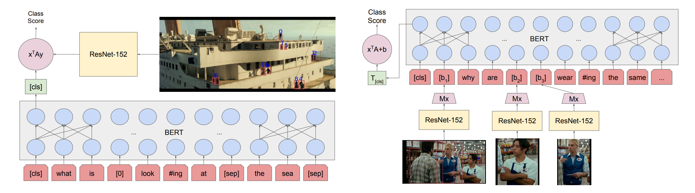

* 预训练模型: 本文的预设预训练任务与ViLBERT类似，包括一个MLM的屏蔽任务和一个匹配任务，区别在本文的Mask仅在文本数据上，方法与BERT一致，而在匹配任务中，负样本的引入不依靠替换文本而是替换一个Impostor Image，通过/<CLS/>来进行分类；
* Addition: 除了比较基本的消融实验，本研究对一些Error Samples进行了分析，得出了比较有趣的结论：在VCR任务中，对于一些跟图像全局相关、或者有更多细节可以帮助回答时，B2T2一般都是表现好于Dual Encoder或者Text-only网络，而在一些只有局部信息的情况下，B2T2的效果可能并不理想。

#### [EMNLP2019] LXMERT: Learning Cross-Modality Encoder Representations from Transformers

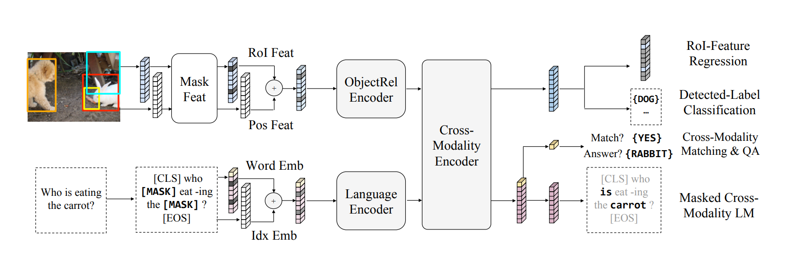

本文总体上和VilBERT差不多，在特征提取的方法上使用WordPiece tokenizer，叠加Word Embedding与Index Embedding并使用LayerNorm，在图片上则是使用Fast R-CNN找到目标ROI后，将图片与Position Information编码并叠加。在Feature Fusion上也与ViLBERT一致使用相似的双流结构，细节上ViLBERT仅在Verbal Token后接Transformer，且一个Fusion Block由一个Co-TRM和一个TRM构成，在LXMERT中则是Verbal与Vision Token都后接Transformer，Fusion Block由一个Cross-attention、一个Self-Attention与一个Feed Forward构成，相当于对一个Transformer内部结构进行的修改；在预训练任务上，使用了比ViLBERT更加丰富的种类，包括MLM&MRM、label classification、VQA与Matching四种任务。

#### VISUALBERT: A Simple And Performant Baseline For Vision And Language

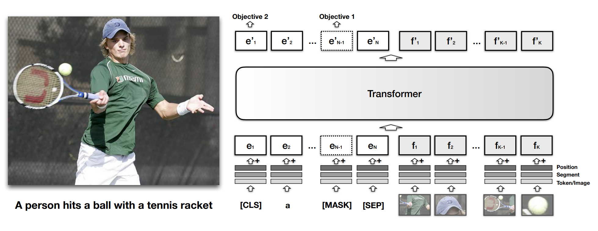

本文总体上采用单流的构型，在文本与图像的编码上与前述文章均类似，文本使用tokenizer叠加三种Embedding，图像则是使用Visual Embedding+Segment Embedding+Position Embedding的结构，其中Segment Embedding用于标定该Token属于视觉而非文本信息，与同为Single-stream的B2T2不同之处是，VISUALBERT是将文本与视觉Token分开送入模型的；在预训练任务上与B2T2一致采取MLM与ITM两种任务，不过在ITM中使用两个Caption，一个为准确Caption，另一个有50%几率被替换为无关内容，模型来加以分辨。

#### [AAAI2020] Unicoder-VL: A Universal Encoder for Vision and Language by Cross-modal Pre-training

本文的方法也是大同小异，使用的是单流的构型，只不过是图片在前，文本在后，文本的tokenizer依旧是WordPiece的编码方法，图片则是使用Fast R-CNN提取ROI区域之后卷积提取特征，叠加一个Position Embedding，对于Mask则是采用用ViLBERT完全相同的方式；在预训练任务中使用MLM、MOC(Masked Object Classification)与VLM。

#### [ICLR2020] VL-BERT: Pretraining of Generic Visuallinguistic Representations

本文为单流构型，编码方式与前面几篇文章都有较大不同，其主要思路是对于所有文本与视觉数据都使用四种不同编码，包括Token Embedding、Visual Feature Embedding、Segment Embedding与Position Embedding；对于Token Embedding，文本数据使用WordPiece，视觉数据使用一个特殊的\ Token；对于Feature Embedding，图像数据的使用Fast R-CNN找到ROI送入神经网络进行特征提取，而对于文本数据则是使用整张图作为ROI进行特征提取，对于位置信息使用一个记录有两角坐标信息的向量通过一个FC获得；Segment Embedding对于不同类型的输入基于不同Embedding，而Position Embedding则是全局输入顺序的编码，对于文本输入有先后顺序，而所有图片ROI是等价的，具有相同的PE。预训练任务包括MLM与MRM，与之前不同的是，在MRM任务中，被Mask的部分再通过Fast R-CNN之前就被置0了，而非在提取特征环节之后，且当某一部分ROI被mask时，全局图片的对应位置也需要被mask，否则会存在“偷窥”问题。

#### [ECCV2020] UNITER: UNiversal Image-TExt Representation Learning

普普通通的单流构型，编码方式依旧是WordPiece+Faster R-CNN，视觉输入的Position Embedding用了一个7维的特征，不知道为什么要用这么冗余的描述，送FC然后得到Token，预训练模型依旧是三个：MLM、MRM与ITM+WRA；

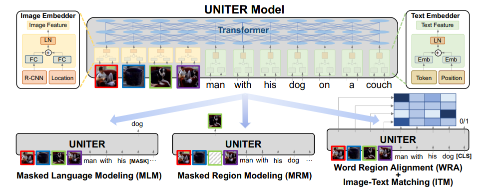

对于MLM与MRM，mask的方式与ViLBERT类似，都是与BERT类似的在特征维度上进行置0，本文的创新点在对MRM Loss的设计上，文中指出相对文本的离散化特征，图像本身的连续性使log likelihood不再合适，本文对MRM任务的目标函数进行了重新设计，包括三类均满足$\mathcal{L}_{MRM}(v_m,w)=\mathbb{E}_Df_\theta(v_m|v_m,w)$的Loss：

1、Masked Region Feature Regression: 使用Transformer的输出送入FC之后来恢复最初的视觉特征，使用L2作为loss: $\mathcal{L}_{MRFR}(v_m,w)=\sum_i||FC(v_m^i)-r(v^i_m)||_2^2$

2、Masked Region Classification: 使用Transformer的输出对ROI进行分类，对于原始的ROI的类别标签使用FC找到其最大响应作为onehot hard label，使用CELoss；

3、Masked Region Classification with KL divergence:与MRC不同的是用的是soft label，使用KL Divergence；

对于ITM+WRA，ITM比较常规，对于WRA则使用一种Optimal Transport方法，学习一个具有：1、自归一性 2、强稀疏性 3、高效性 的转移矩阵$\mathbb{T}^{K\times T}$，使其在与文本-图像对的cosine相似度矩阵逐元素乘的时候可以最小化。

#### [ECCV2020] Oscar: Object-Semantics Aligned Pre-training for Vision-Language Tasks

本文发表于ECCV2020，首先对Vision Language Pretrain的研究进展进行了一个综述性的概括，文中指出，目前VLP的Pipeline主要是对文本-图像对的文本Caption和视觉ROI区域使用Pretrained Encoder进行编码，之后通过Stream Network来完成预训练任务；在对应的语义空间中，ROI区域的物体Label在文本中的对应词汇应该是有相同，或者近似的语义特征的；而真实情况往往是后者，在文本编码的语义空间中，特征分布往往是（分布上）稀疏的，而视觉空间中则往往是致密的，前者的表征能力更强；基于上述分析，目前的VLP工作有两点局限：1、基于Faster R-CNN的图像ROI提取模糊性，模型提取到的区域重叠度高，语义高度模糊；2、ROI区域与文本间缺乏匹配，对于ROI区域的Label在理想情况下应该也是出现在Caption中的，其之间的对应关系没有被有效利用；

本文提出的OSCAR模型在传统VLP的Linguistic、Visual输入的基础上，推出了Object Tag Input的三模态输入$(w,q,v)$，文中还提出了两种视角下的训练任务，包括Dictionary View与Modality View（想不到好翻译）：

$$
x\overset{\underset{\Delta}{}}{=}[w,(q,v)]=[(w,q),v]\overset{\underset{\Delta}{}}{=}x’

$$

其中w为使用Pretrained BERT编码的Caption特征，q为ROI Tag特征，v为图像特征，q与v生成的是通过调用Pretrained Faster R-CNN来进行的，对于q使用与w相同的BERT进行编码，对于有相似语义的词其在空间中的特征向量也必然是相近的，会因此得到更高的注意力权重，对于v，本文使用了将Position Embedding concatenate在Visual Embedding后面的方法，这个还是挺有意思的（虽然我感觉会导致一个4-6维特征淹没在Visual Embedding的2048维特征中），之后使用一个FC来调整维度；

从Dictionary View来看，w与q属于文本特征，v属于视觉特征，对于离散的文本特征使用MLM作为预训练任务，使用对数似然来作为目标；从Modality View来看，w来源于文本，q与v来源于视觉，使用VLM来作为预训练任务，与常规的VLM不同的是，本研究的VLM任务有50%保持原状，25%替换掉了Label，25%替换掉了Caption，分类目标也从原来的二分类变成了对于替换内容预测的三分类。

#### Pixel-BERT: Aligning Image Pixels with Text by Deep Multi-Modal Transformers

本文是单流构型，主要创新点在对图像数据的Token获取上，文中指出先前的文章往往使用Top-down Attention，如训练好的Faster R-CNN来做特征提取器，这种预训练的Faster R-CNN会被其原先的训练场景所束缚；而本文不从ROI的角度，而是从像素的角度来表征一副图片，使用CNN对其进行卷积操作并Pooling，后随机从feature map中抽取100个像素展平作为Token；在预训练任务选择上，使用MLM与ITM。

#### [ACL2021] UNIMO: Towards Unified-Modal Understanding and Generation via Cross-Modal Contrastive Learning

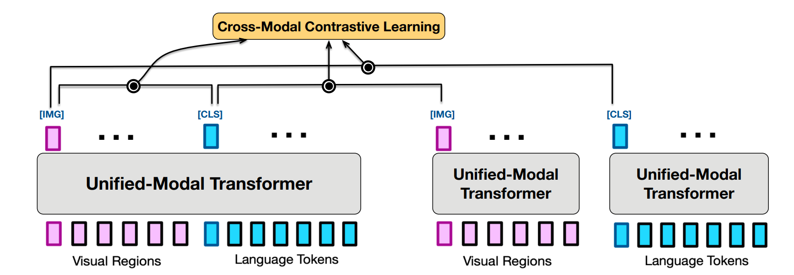

本文采用了一种三流构型（名字有待商榷），文章指出通过将多模态的数据与单模态的数据同时利用，可以有效地扩大可使用的数据量，给模型提供大量的额外学习样本。编码方式和模型结构都是老生常谈的方法，本文最大的创新点是融合了一种cross-modal contrastive learning(CMCL)的技术，其大致思路有两种：Text Rewriting与Text/Image Retrival，其中前者是将文本-图像对中的文本在sentence/phrase/word三个维度进行重写，通过近义词替换来获得正样本，反之负样本，使用相似度算法找到语料库中与该描述相似但不同的sentence作为负样本；对于后者则是找到文本/图像库中与当前文本/图像相似度最高的样本进行一个single-modal相似度计算，来作为对比学习的样本，对于对比学习的细节，需要[额外复习](https://zhuanlan.zhihu.com/p/141172794?ivk_sa=1024320u)。

SimCLR（正负样本相似度，归一化夹角最近最远）→BYOL（只有正样本）

#### [ICML2021] CLIP: Learning Transferable Visual Models From Natural Language Supervision

依旧是对比学习的工作，非常novel的idea，文本与图像的编码均使用Transformer结构，特别说明的是图像使用的是ViT进行编码。该工作的数据来源除了常用的公开数据集MSCOCO等之外，还从网络上爬取的大量图像-文本对，进行数据清洗之后来加入到训练之中；该模型的预训练任务为一对比学习，对于相关的图像-文本对计算其Transformer输出的相似度尽可能大，而非相关的文本-图像对尽可能小，这样就形成了一个相似度矩阵中对角线元素较大（对角占优）其余元素较小的矩阵，可以近似为一个one-hot分类，使用CELoss；在此基础上通过对文本库使用预训练的Text Transformer进行编码，找寻zero-shot图像的ViT输出相似度最大值，就可以实现对图片描述内容的zero-shot prediction。

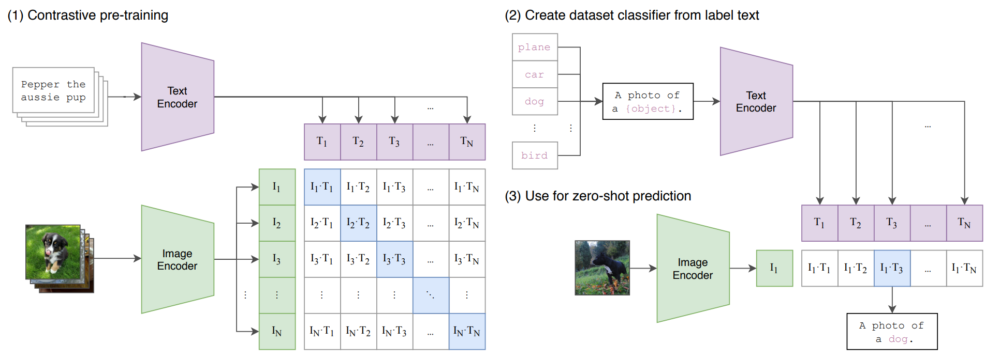

#### Data2Vec: A General Framework for Self-supervised Learning in Speech, Vision and Language

* Motivation: 传统类比NLP领域获得encode token的方法，在CV、SP领域往往五花八门，方法复杂繁多，本文的目标是提出一种普适性的自监督编码器，可以适用于包括NLP、CV与SP领域的数据。
* Solution: 提出了一种Data2Vec结构，该结构包含一对Teacher-Student pair，对不同模态的数据进行编码、掩码后送入统一的Student Network，对原始数据编码送入Teacher Network，通过动态更新两个网络的参数来实现对模型编码后的表示的学习。
* Method(structure): 具体来讲，在数据编码、掩码部分与传统自监督方法类似，如在NLP对数据进行token embedding并掩码，对CV数据进行分块线性变换后对block进行掩码。与传统方法不同的是，data2vec的学习目标不是对掩码的恢复，而是对掩码经过模型编码后的表示进行恢复，这一表示是经过模型编码的，故有1.模态无关性；2.连续性；3.语义丰富性 的特点。
* Method(Detail): 对于Teacher-Student Pair，为了保持模型的一致性，使用共享的参数进行训练。对于具体的Training Target，通过找到Student输入中被Mask掉的step对应在Teacher里倒数K层的归一化输出平均值来获得target。使用Smooth L1 Loss来作为损失函数。
* Result&Improvement: 与传统自监督学习方法不同，data2vec使用了对掩码进行编码后的表示作为优化目标，并使用了多个Transformer Layer的平均输出，实现了对多模态数据的自监督学习目标的统一。可以看到网络在三种不同模态数据的处理任务中都对之前的结果有所提升，虽然在NLP领域变化不大，但是作为一种多模态适用的处理方法也十分具有创新性。

#### [ICML2021] ViLT: Vision-and-Language Transformer Without Convolution or Region Supervision

本文首先对时下的Vision-Language Pretrain模型做了一个比较详细的综述，作者将这一任务的实现路径按照对于编码的复杂度与混合模型的复杂度分为四类：

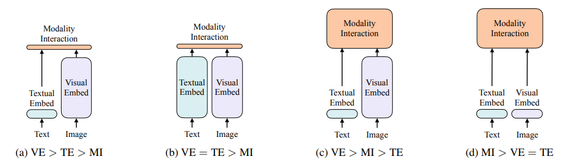

第一类的模型在视觉数据的编码上使用更重量级的网络，而文本使用轻量级模型来进行编码，对于模态融合的模型则是一个简单的实现，这一类比较典型的是VSE系列模型；第二类则是在文本上也是用重量级的模型来进行编码，比较典型的是CLIP；第三类则是相对第一类模型使用了更复杂的模态融合方法，大部分网络如ViLBERT、Pixel-BERT都是这一类的模型；文章指出对于前三类的模型，视觉的编码往往十分繁琐，计算量非常大，所以本文提出了一种极其简单的视觉与文本编码方式，把重点主要放在模态融合部分；

本文对于文本的编码依旧是WordPiece，而对于图像编码使用了类似ViT的image-patch方法，将图像分成小的块并使用一个简单的线性编码器进行编码，与Modal Embedding与Position Embedding(这里是对应小patch的顺序)叠加作为visual token。

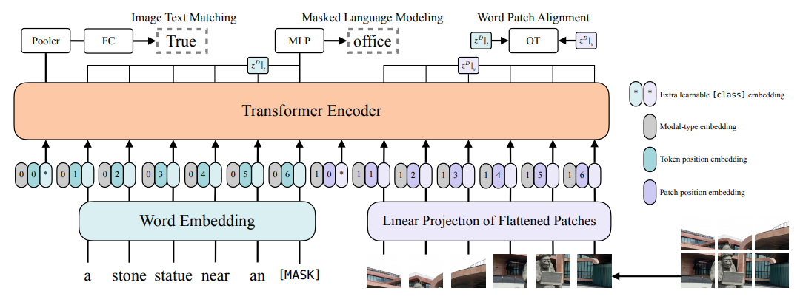

作为一个单流构型，其在Visual Token与Language Token中都添加了\<CLS>为下游任务做预留，其预训练任务包括ITM与MLM，方法都比较传统；该模型的主要优点是在下游任务基本持平或甚至部分超出其他模型的情况下，运行时间相比UNITER缩短了60倍，相比Pixel-BERT缩短了4倍。

#### [CVPR2021] OSCAR+: VinVL: Revisiting Visual Represent-ations in Vision-Language Models

xGQA里提到了cue到了OSCAR+，所以掉头回来复习一下，结果OSCAR+果然之前还有个[OSCAR](#OSCAR)，所以先看OSCAR了；
本文开宗明义地指出，之前的VLP研究几乎都停留在对多模态特征的融合上，而少有对前端编码器的设计，本文对OSCAR所使用的编码器进行了改进，提出了一种对于针对VL任务专用的视觉编码器；
基于OSCAR得到的结果，图像ROI的label对于模型的多模态学习有很大的帮助，本文延续了这一思路，并提出了一种全新的Object Detection Model，由于缺乏非常有效的针对性数据集，本文提出了一种新的训练思路；在数据集上文中整合了MSCOCO、OpenImagesV5、Objects365V1与VisualGenome四个数据集；在网络结构上，虽然之前的研究曾经证明FPN的结构相对C4有更强的特征表征能力，然而本文经过精心设计的实验证明C4具有更好的性能，其原因主要是由于C4的预训练权重在缺乏足量数据的情况下相对FPN的未经预训练的FC有更大优势，且卷积结构的表征能力也要好于FC；选择ResNeXt152 C4预训练模型，并添加了一个attribute branch用来生成ROI额外的attribute；
在预训练任务上，选取MLM与VLM+VQA两种任务，在MLM上选择经典的方法，在VLM上使用与OSCAR相似的制造负样本的方式，但是在Loss上则与OSCAR不同，增加了对于VQA的额外负样本。

## Multilingual Cross-modal Pretrain

#### [ACL2020] Multimodal Transformer for Multimodal Machine Translation

很短的一篇文章，其思路就是通过引入其他模态信息的方式，实现对机器翻译能力的提升；文中指出虽然通过引入视觉信息来辅助文本翻译任务，文本和视觉信息在模型中并不是等价的，文本相对视觉特征来说更为重要，所以在模型的结构上，Transformer的Query生成依靠Vision +Language，而Key与Value则仅仅使用Linguistic Information，输出如下：

$$
c_i=\displaystyle\sum_{j=1}

$$

#### [ACL2020] Unsupervised Multimodal Neural Machine Translation with Pseudo Visual Pivoting

#### [CVPR2021] M3P: Learning Universal Representations via Multitask Multilingual Multimodal Pre-training

作者指出近些年提出了许多预训练大模型，包括传统的Monolingual BERT、GPT系列，Multilingual MBERT、Unicoder，Multimodal ViLBERT、UNITER等，然而对于多语种、多模态的预训练任务还没有被深入研究，本文提出一种Multitask, Multilingual, Multimodal Pretrained Model(M3P)，来对这一领域进行探索；

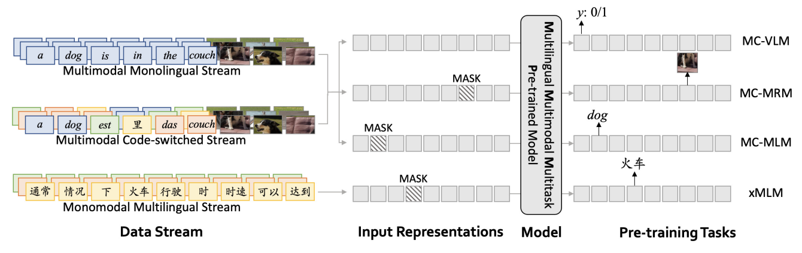

本文的输入有三种：Multilingual Monomodal Stream、Monolingual Multimodal Stream与Multimodal Code-switched Stream;前两者为一般的文本或文本+图像Token输入，文本使用SentencePiece编码，相比Monolingual增加了Language Embedding用来标定文本的语言，图像使用Faster R-CNN编码，后者则是将语句中单词以概率$\beta$随机替换为multilingual中的随即语言的对应单词中的一个，文中并没有修改替换文字之后的Language Embedding，因为没有明显变化；
预训练任务分为Multilingual Masked Language Modeling(xMLM)与Multimodal Code-switched Training两种，其中前者按照语言在语料库中的比例$p_{l_i}$对语料进行soft-sample组成batch:$\lambda_{l_i}=\displaystyle\frac{p_{l_i}^\alpha}{\sum_ip_{l_i}^\alpha}$，按BERT的方式对Multilingual的Language batch进行MLM训练；后者又被细分为三种：MC-MLM、MC-MRM与MC-VLM，这一部分使用的数据为Monolingual与Multilingual按一定比例混合采样的batch，其中MC-MLM延续了xMLM中的mask和训练方式；在MC-MRM中，则是使用与ViLBERT一样的mask方式，训练目标有两个：对ROI特征向量的恢复CE与与Faster R-CNN one-hot输出的KL Divergence；MC-VLM与之前Monolingual的任务一致；
从结果来看，在M3P基础上对所有语言的混合标签样本进行预训练的效果是最好的，文中还验证了Multimodal Code-switched Training对学习的贡献。

#### [CVPR2021] UC2: Universal Cross-lingual Cross-modal Vision-and-Language Pre-training

本文提出一种基于图像数据并使用英语文本与之补充的多语言跨模态表征模型：UC2，该模型的训练是基于英文文本-图像数据库并应用机器翻译来扩增数据集来进行训练的，具体来说该研究使用模型对3.3M例英文文本-图像对进行文本翻译，获得了对应图片的6种语言描述；

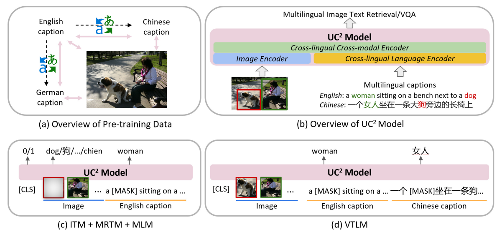

该模型的架构为一个单流构型，图像数据使用传统方法，对待跨语种文本，使用XLM-R的方法对其进行编码，首先对各种语言的语料库使用soft-sample对多语种BPE词表进行采样拼成大词表，输入样本使用SentencePiece构建BPE，投影至目标维度，使用Word Embedding，Segment Embedding与Position Embedding组合构建Token；
本文选择了MLM+ITM作为预训练任务，需要指出的是，送入模型的文本-图像对是在多语种训练集中按语种间等概率采样得到的；本文还额外提出了两种训练方法：Masked Region-to-Token Modeling(MRTM)与Visual Translation Language Modeling(VTLM)；作者指出，对于传统的MRM方法，1、并没有利用到Faster R-CNN检测到的物体与文本中对应语义的关联信息，2、提取的Visual Embedding会与对应单词的Lingual Embedding完全不同；本文提出的MRTM使用预训练的目标检测器对ROI区域进行分类生成伪标签，该标签是基于对图片描述的文本库中选择的，之后对ROI区域使用同ViLBERT相同的mask方式，训练目标是预测其伪标签；对于第二个问题文章使用了一种对图像编码器预热的方法：对于Image Encoder的输出，找到其在描述中对应伪标签的文本Token，通过最小化KL Divergence的方法来对Image Encoder的权重进行一个warmup，来使二者的Embedding更加接近；
上述预训练方法均是Monolingual的，对于多种语言的输入文中提出了VTLM，该方法以图像-英文文本-其他语言文本作为联合输入来进行MLM，可以使模型学到更多跨语种的知识；文中提到由于对于多语种的编码使用了本身就很强大的XLM-R模型，其Token之间本身就携带了很多多语种的关联信息，所以为了鼓励模型更多的从图像中获得信息，本文提出了一种comask的方法，使用Fast Align对文本间的同义词进行关联，当对其中一个0词进行mask时，另一语种的关联词也会被mask掉，这样可以有效的让模型从图像中获取信息，使用最大似然作为目标函数。

#### [ICML2021] ALIGN: Scaling Up Visual and Vision-Language Representation Learning With Noisy Text Supervision

Google的文章，充斥着暴力美学。文章指出现有工作都是基于付出巨大的人力成本、时间成本精挑细选的数据集，大大地限制了数据集的规模；作者提出在巨大的训练数据量的前提下，数据集的噪声将得到掩盖，所以使用一个比常规数据集大100倍的有噪声数据集，仅仅经过了简单的筛选（过短过长的描述、有效词过少、过大过小的图片尺寸）就送入一个简单的对比学习模型ALIGN(A Large-scale Image and Noisy-text Embedding)，得到了十分好的效果；之所以选择这篇文章，是因为在结尾处文章指出由于数据来源多种多样，且这个巨大的数据集没有对文本的语言进行描述，也没有对其进行Embedding区分，但这些因素并没有限制模型对各种语言的学习能力，模型在测试表现上不受语言的约束，甚至在英文与法语Zero-shot的结果要远远好于针对这一任务设计的M3P，甚至高于M3P与UC2的Finetune后结果（Money is all u need)。

#### Retrieve Fast, Rerank Smart: Cooperative and Joint Approaches for Improved Cross-Modal Retrieval

目前多模态检索方法多是基于Transformer的联合处理文本和视觉输入，其交叉注意力机制可以覆盖多模态输入的全部图像目标和文本信息；然而依然存在从头训练可拓展性差、检索延迟大速度慢等问题，本文提出了一种finetune框架，实现对预训练模型到高效检索模型的转换；

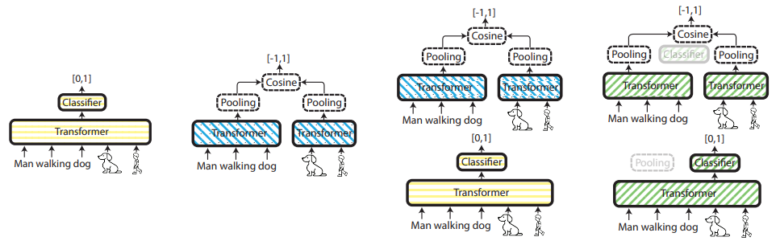

基于普遍使用的联合编码器Cross-Embedding与双编码器Bi-Embedding，本文提出了两种新的方法：Seperate Training Cooperative Retrieval(STCR)与Joint Training Cooperative Retrieval(JTCR)，前者分开训练BE与CE，首先利用BE在一个很广的范围搜索topk作为一个更小的搜索范围，之后使用计算量更大同时更加精确的CE在这个子搜索空间内找到最佳目标，这种方法虽然效率较高，但是也非常占用存储，内存消耗极大；而后者则是共享权重的BE与CE，在使用方法上与前者一致，但空间利用率更高，内存消耗较小；
模型在一部分任务上达到了SOTA，且相比单独使用CE要快了20倍以上；

#### [EMNLP2021] MURAL: Multimodal, Multitask Retrieval Across Languages

文中指出ALIGN在部分语言模型上的SOTA级表现，然而其使用的数据集Alt-text严重的偏向了数据量丰富的大语种，这一不均等的现象严重限制了ALIGN对小语种的表征能力，作者提出了一种表征能力更强的文本翻译对，来辅助模型对小语种的理解；

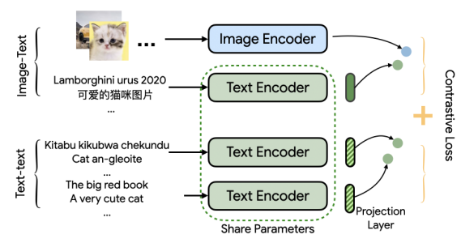

文章在图像-文本对的基础上增加了文本翻译对的学习任务，通过一个加权Loss来进行同时训练：$\mathcal{L}=\mathcal{w}_{i2t}(\mathcal{L}_{i2t}+\mathcal{L}_{t2i})+\mathcal{w}_{t2t}(\mathcal{L}_{l2r}+\mathcal{L}_{r2l})$，其中每一个Loss都是in-batch softmax形式:$\mathcal{L}_{i2t}=-\displaystyle\frac{1}{N}\sum_i^Nlog\frac{exp(sim(x_i,y_i)/\tau)}{\sum_{j=1}^Nexp(sim(x_i,y_j)/\tau)}$，其中$\tau$为一个温度项，在i2t任务中时刻学习的，在t2t任务中被设置为0.01；在编码器的选择上，对图像数据使用EfficientNet-B5，文本数据使用BERT；在数据集上，本文利用了与UC2相似的策略，采用一个Neural Machine Translation system对数据集进行处理，来获得额外语种的数据；
从结果来看，模型在大语种与小语种的表现上，无论是zero-shot还是fine-tune，均要好于ALIGN的SOTA结果，尤其是在小语种上提升十分显著。

#### xGQA: Cross-Lingual Visual Question Answering

本文对语种在语言学上的分类有一定的执念，一直强调自己提出的是首个真正意义上覆盖了最广泛的语言学类别的benchmark，包括日耳曼语、罗马拉丁语、斯拉夫语、南岛语等七个亚语系的八种语言；在xGQA的few-shot数据集上，选取了50个样本作为Develop Set，300个样本作为Test Set，分别有1422与9666个问题与之对应，在问题上有包括正误判断、Query获取、二选一、逻辑判断与对比判断五种；

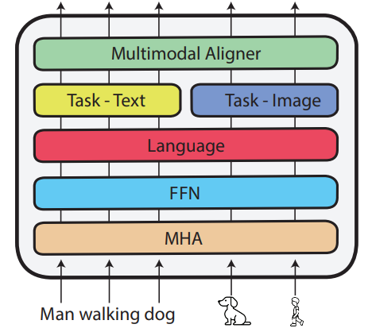

在任务选择上文章研究了基于M3P的zero/few-shot迁移与一种新的为SOTA多语言模型提供多模态能力，为多模态模型提供多语言能力的方法；对于训练方法采用与GQA一致，将所有可能的答案使用one-hot编码对应其独特的类别标签，将QA任务作为一个分类任务来完成；
文中使用的zero-shot方法是指仅仅使用目标语言的weights来替换source语言(英语)，而few-shot则是在替换的基础上是用少量目标语言的样本进行一个fine-tune；
文中多次cue到了OSCAR+，所以先看完[OSCAR+](#OSCAR+)；本文提出了两种全新的更简便的方式来获得多语种多模态预训练模型，分别为：1、从现存多模态模型中拓展多语种能力；2、从现存多语种模型中拓展多模态能力，这两种方法都是follow一个两步走的思路来进行的，包括language-extention phase与target-task phase；对于前者，本文提出了两种基于OSCAR+的改进方案，分别命名为OSCAR+Emb与OSCAR+Ada，在language-extention phase，Emb对于OSCAR+的编码层进行了随机初始化，并针对这一层进行对不同语言的fine-tune，而Ada则在Emb的基础上在每一个Transformer模块中的Multihead Attention和Feedforward之后添加一个针对不同语言的Language adapter，都是使用MLM任务来进行训练；在target-task phase，在Emb我认为论文没有阐述清楚是如何完成的，大概就是把Language Embedding用目标语言替换后对小语种数据进行fine-tune，而Ada中，Cross Modal embedding被送入了Task Specific Adapter，对于不同模态的数据进行处理，之后送入一个Multimodal Aligner进行融合，在此阶段的训练中都是锁定MHA到Language Adapter来fine-tune后两层的；对于第二种实现方式，使用mBERT作为基础，在language-extention中不需要任何操作，因为该模型本来就是有跨语种的编码能力的，而在target-task phase中，本文基于OSCAR+的方法对模型Cross Modal进行拓展；
从结果上来看，对于zero-shot任务mBERT表现更好，而随着few-shot网络获得的样本数量增加，模型表现也逐步提高，在M3P上的表现要明显优于其他模型。

#### Wukong: 100 Million Large-scale Chinese Cross-modal Pre-training Dataset and A Foundation Framework

本文提出了一个一亿量级的图像-文本对数据集，并在多种现存模型上对该数据集进行了训练与测试；文中的出发点在于，目前的大量开源英文的Image-Text Pair Dataset对于downstream的基于英文翻译而来的中文任务是效果很好的，但是对于很多native Chinese来说，英文翻译并不能理解很多中文的地道表述，所以构建一个中文大型数据集是十分有必要的；

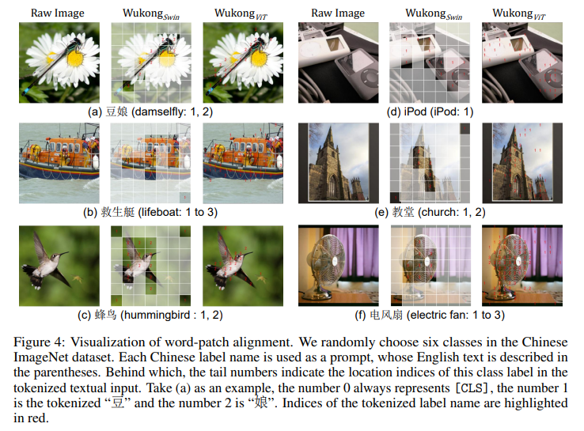

看了一下下面的部分，感觉参考意义不大，实验设计的有点不合理。

#### Delving Deeper into Cross-lingual Visual Question Answering

本文对于现在的Multilingual VQA任务在三个方面进行了优化：1、分类头；2、输入编码；3、fine-tune模式；在分类器上，现在的VQA任务大多停留在对\<CLS> Token连接一个单层分类头的阶段，本文为其添加了一个使用GELU激活的2层transformation network($f_{trans}$)；在输入Embedding上，对于不同的VQA任务本文选择了不同的分类头，问题的输入使用一个\<QType>进行标定，如果该问题是如分类的任务，则使用一个二分类头而非从大量的固定输出中选择；

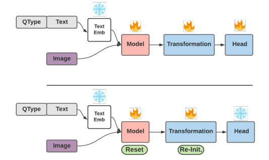

对于fine-tune方法，本文提出了两种：1、Freezing Text Embeddings(FT)与2、Self-Bootstrapping(SB)；前者冻住Text Embedding Layers，仅对Transformer与Classification Head进行优化；而后者作者指出zero-shot fine-tune对于权重初始化非常敏感，而如果Classifier Head已经优化的前提下，对于权重则没那么敏感，该方法在FT的基础上对Transformer的权重进行的reset并对$f_{trans}$的权重进行了初始化，冻结Embedding和Head的权重进行fine-tune；可以看到模型在VQA上的表现在加入了QType+SB的情况下表现提升十分明显。
